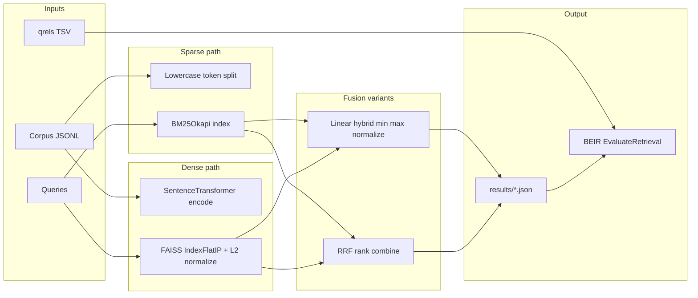
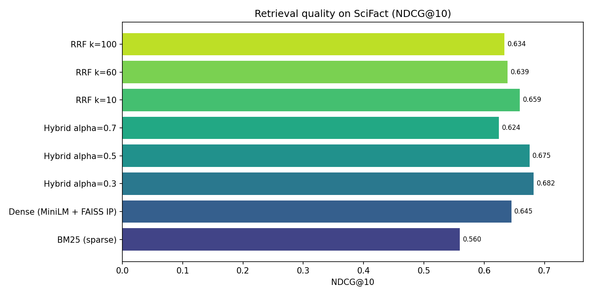
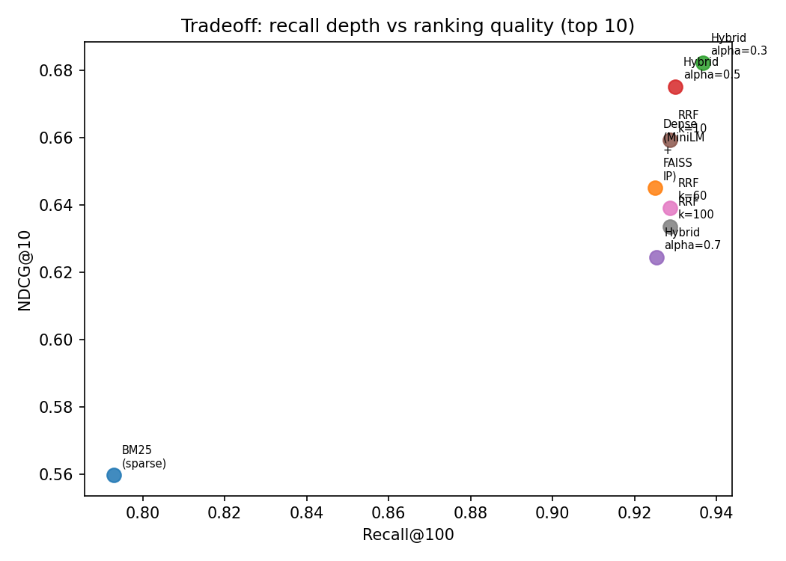
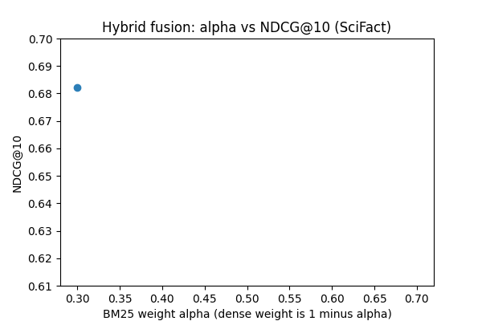
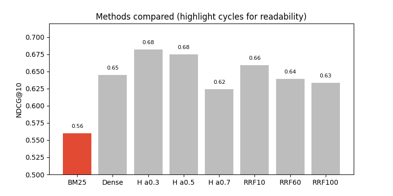

# Retrieval Benchmarking on SciFact

## Executive summary

This repository compares classical sparse retrieval, dense semantic retrieval, and hybrid strategies on the SciFact test split using the BEIR evaluation stack. The strongest configuration in the current artifact set is **weighted hybrid fusion with alpha equal to 0.3**, meaning **more weight on the dense channel** than on BM25, which reached **NDCG@10 of 0.682** and **Recall@100 of 0.937**. Dense retrieval alone already **clearly outperforms BM25** on ranking quality, while BM25 remains a useful signal that hybrid fusion can blend. Reciprocal rank fusion (RRF) with **k equal to 10** performed best among the RRF runs but **did not beat the best linear hybrid** on NDCG@10. A longer narrative, methodology, and figures appear below. For a print style version suitable for Overleaf, see `latex/RAG_Benchmark_Report.tex`.

---

## 1. Background and purpose

The work originated as an **R2L Lab onboarding quiz** style exercise: implement retrieval pipelines, run a standard information retrieval benchmark, and reason about tradeoffs. SciFact is a good fit because queries are short scientific claims and relevance judgments are **sentence level** and **fact checking oriented**, which stresses both lexical overlap and semantic paraphrase.

The codebase is **not** a full RAG stack with a generator. It is **retrieval only**: given a query, produce a ranked list of documents. That boundary matters when you interpret metrics: gains reflect **retriever quality**, not end to end answer correctness.

---

## 2. Dataset and task

| Aspect | Detail |
|--------|--------|
| Dataset | SciFact (BEIR format under `datasets/scifact/`) |
| Split | Test (loaded via `GenericDataLoader(..., split="test")`) |
| Corpus | Title plus abstract style text concatenated per document |
| Queries | Claim text strings keyed by query ids |
| Labels | `qrels` in TSV form for evaluation |

SciFact pairs claims with evidence abstracts. **Sparse models** excel when query terms literally appear in cited work. **Dense models** help when wording diverges but the underlying proposition aligns in embedding space.

---

## 3. System architecture

The following diagram summarizes data flow from corpus preparation through evaluation.



**Reasoning behind each block**

1. **Title plus text concatenation** matches common IR practice and gives BM25 more lexical surface area than title alone.
2. **FAISS inner product on L2 normalized vectors** is equivalent to **cosine similarity** for ranking, which pairs naturally with sentence embeddings.
3. **Hybrid linear fusion** rescales BM25 and dense scores per query with **min max normalization** before combining. That reduces scale mismatch between log style BM25 mass and cosine similarities.
4. **RRF** ignores raw magnitudes and merges **ranks** only, which can be more stable when score scales differ in awkward ways, at the cost of discarding calibrated strength of evidence.

---

## 4. Methods in code

### 4.1 Dense retrieval (`dense_retrieval.py`)

- Model: `sentence-transformers/all-MiniLM-L6-v2` (384 dimensions, strong speed quality tradeoff).
- Index: `faiss.IndexFlatIP`, exhaustive search (exact for the index type, no compression).
- Top k: 100 documents per query, written to `results/dense_results.json`.

**Why this design:** MiniLM is a standard baseline for prototyping. Flat IP is simple and reproducible; for larger corpora you would switch to IVF or HNSW with careful recall tuning.

### 4.2 Sparse retrieval (`sparse_retrieval.py`)

- Uses `rank_bm25.BM25Okapi` over whitespace tokenized, lowercased documents.
- Optionally downloads SciFact via `beir.util.download_and_unzip` when run standalone; other scripts assume `datasets/scifact` already exists.

**Why this design:** BM25 is an interpretable lexical baseline. Simple tokenization is fast but **does not** apply stemming or clinical vocab normalization, which caps achievable lexical recall on noisy text.

### 4.3 Linear hybrid (`hybrid_retrieval.py`)

For each query, BM25 and dense each return top 100. Scores are min max normalized within each channel, then combined:

`hybrid_score = alpha * bm25_norm + (1 - alpha) * dense_norm`

Three alphas are baked into the driver: **0.3, 0.5, 0.7**. Outputs:

- `results/hybrid_results_alpha_0.3.json`
- `results/hybrid_results_alpha_0.5.json`
- `results/hybrid_results_alpha_0.7.json`

**Interpretation:** Larger alpha **favors BM25**. The empirical optimum here favors **smaller alpha**, so **dense dominates**. That pattern often appears when queries are abstract or semantically framed while still benefiting from occasional lexical anchors.

### 4.4 Reciprocal rank fusion (`hybrid_retrieval_rff.py`)

RRF score for a document sums `1 / (k + rank)` from each ranked list. Scripts run **k in {10, 60, 100}**. Smaller k puts more weight on top positions; larger k flattens emphasis.

Outputs: `results/hybrid_rrf_k_10.json`, `hybrid_rrf_k_60.json`, `hybrid_rrf_k_100.json`.

### 4.5 Evaluation (`evaluation.py`)

Uses `beir.retrieval.evaluation.EvaluateRetrieval` with cutoffs **10 and 100** for NDCG, MAP, Recall, and Precision.

---

## 5. Metrics and how to read them

| Metric | What it rewards | Why it matters here |
|--------|-----------------|---------------------|
| **NDCG@10** | Ordering quality in the first ten hits | Simulates a user who reads only a short slate of abstracts |
| **NDCG@100** | Ordering across a deeper pool | Closer to reranker or cross encoder input sets |
| **Recall@100** | Whether any relevant doc appears in top 100 | Important if a second stage model reranks |
| **MAP** | Mean precision averaged over relevant ranks | Single number summary of precision recall balance |
| **P@10 / P@100** | Raw precision at cutoff | Often low in sparse multi relevance settings; interpret with care |

SciFact has **multiple relevant documents per query** in many cases, so precision at 10 stays modest even when NDCG is healthy.

---

## 6. Results

All numbers below were produced with the **committed result JSON files** and `evaluation.py` against `datasets/scifact` test qrels. Hybrid alpha **0.3** is the best NDCG@10 configuration in this table.

### 6.1 Summary table

| Configuration | NDCG@10 | NDCG@100 | MAP@10 | MAP@100 | Recall@10 | Recall@100 | P@10 | P@100 |
|---------------|---------|----------|--------|---------|-----------|------------|------|-------|
| BM25 sparse | 0.5597 | 0.5839 | 0.5147 | 0.5202 | 0.6862 | 0.7929 | 0.0763 | 0.0089 |
| Dense MiniLM + FAISS | 0.6451 | 0.6767 | 0.5959 | 0.6031 | 0.7833 | 0.9250 | 0.0883 | 0.0105 |
| Hybrid alpha 0.3 | **0.6822** | **0.7118** | **0.6395** | **0.6460** | **0.8033** | **0.9367** | **0.0907** | **0.0106** |
| Hybrid alpha 0.5 | 0.6751 | 0.7016 | 0.6282 | 0.6339 | 0.8102 | 0.9300 | 0.0910 | 0.0106 |
| Hybrid alpha 0.7 | 0.6244 | 0.6639 | 0.5824 | 0.5909 | 0.7448 | 0.9253 | 0.0833 | 0.0105 |
| RRF k = 10 | 0.6592 | 0.6874 | 0.6084 | 0.6150 | 0.8039 | 0.9287 | 0.0900 | 0.0105 |
| RRF k = 60 | 0.6391 | 0.6752 | 0.5944 | 0.6021 | 0.7654 | 0.9287 | 0.0857 | 0.0105 |
| RRF k = 100 | 0.6335 | 0.6736 | 0.5919 | 0.6006 | 0.7488 | 0.9287 | 0.0840 | 0.0105 |

### 6.2 Static plots

**Figure A.** Horizontal bar chart of NDCG@10 across all runs (generated asset).



**Figure B.** Scatter of Recall@100 versus NDCG@10 with labels (shows that most advanced configs cluster at high recall with different top ten ordering quality).



### 6.3 Moving plots (animated GIFs)

These files loop in standard Markdown viewers (GitHub, many IDEs). They are meant to **draw attention to comparisons** rather than to introduce new data beyond what is in the table.

**Animation 1.** Interpolated sweep between the three recorded hybrid alpha settings, tracing NDCG@10. The motion reinforces that **performance peaks when dense weight is high** for this model and split.



**Animation 2.** Cycling highlight across methods on a shared bar chart baseline, to ease visual comparison when many categories are present.



To regenerate figures:

```bash
pip install matplotlib pillow
python scripts/generate_report_figures.py
```

---

## 7. Discussion

### 7.1 Why dense beats BM25 here

Dense retrieval closes the **lexical gap** between claims and evidence when authors use different terminology. SciFact claims are short; embeddings pool evidence over the whole abstract, which often improves robustness compared to bag of words overlap alone.

### 7.2 Why hybrid with alpha 0.3 helps further

BM25 still contributes **exact token matches** for rare entities or chemical names that embeddings occasionally mishandle. A modest BM25 weight (alpha 0.3) injects that signal **without** letting noisy sparse scores dominate ranking, which is what appears to happen at alpha 0.7.

### 7.3 Why RRF did not win outright

RRF here is competitive but **below the best linear hybrid** on NDCG@10. Possible reasons include: (1) both lists are already high quality and min max weighted fusion preserves useful **magnitude** information; (2) k values explored may not align with the ideal operating point for this corpus size; (3) rank depth is fixed at 100 for both channels, which changes the effective rank distribution RRF sees.

### 7.4 Recall@100 plateau

Several dense and hybrid configurations sit near **0.93** Recall@100. Once recall saturates, **NDCG@10** becomes the main differentiator, which is exactly where hybrid alpha 0.3 gains.

---

## 8. Limitations and threats to validity

1. **Single embedding model:** Only `all-MiniLM-L6-v2` is wired in. Larger domain adapted encoders would likely shift absolute numbers and might change the best alpha.
2. **Tokenization:** Whitespace splitting is weak for biomedical morphology compared to SciSpacy or similar.
3. **No statistical testing:** Differences are point estimates without bootstrap confidence intervals.
4. **Retrieval only:** No measure of downstream claim verification accuracy.
5. **Score files in `scores/`:** Some stored files mirror console logs and are **not valid JSON** as committed; automated plotting should read machine readable exports instead.

---

## 9. Suggested enhancements

These align with `README.md` but are expanded here with rationale.

| Enhancement | Expected benefit |
|-------------|------------------|
| Cross encoder reranking on top 50 | Large NDCG@10 gains typical in BEIR leaderboards |
| Domain adapted encoders (e.g. SPECTER style) | Better semantic geometry for scientific text |
| Proper tokenizer and stopword policy for BM25 | Cleaner term statistics |
| IVF or HNSW FAISS for scale | Needed before scaling corpus size |
| Confidence intervals via bootstrap | Stronger claims when comparing alphas |
| Unified results schema (JSONL) plus small CLI | Easier plotting and experiment tracking |
| Fix `scores/dashboard.py` paths and input format | Working HTML dashboard from evaluation dumps |
| Requirements file with pinned versions | Reproducible installs |

---

## 10. Reproducibility checklist

1. Place or download SciFact under `datasets/scifact/` in BEIR layout (corpus, queries, qrels).
2. Install Python dependencies (see `README.md`).
3. Run `python dense_retrieval.py`, `python sparse_retrieval.py`, `hybrid_retrieval.py`, `hybrid_retrieval_rff.py` as needed (some scripts assume data already local).
4. Evaluate each output with  
   `python evaluation.py datasets/scifact results/<file>.json`
5. Regenerate figures with `python scripts/generate_report_figures.py` if you change results.

---

## 11. Repository map

| Path | Role |
|------|------|
| `dense_retrieval.py` | Dense indexing and retrieval |
| `sparse_retrieval.py` | BM25 retrieval (optional download) |
| `hybrid_retrieval.py` | Linear fusion sweeps |
| `hybrid_retrieval_rff.py` | RRF sweeps |
| `evaluation.py` | BEIR metrics driver |
| `results/*.json` | Ranked runs used in this report |
| `scripts/generate_report_figures.py` | Plot and GIF generation |
| `report_assets/` | PNG and GIF artifacts referenced above |
| `latex/RAG_Benchmark_Report.tex` | Overleaf oriented PDF narrative |

---

## 12. Closing remarks

The repository delivers a **clean comparison** between sparse, dense, weighted hybrid, and RRF hybrid retrieval on SciFact using transparent scripts and standard BEIR evaluation. The empirical story is straightforward: **dense retrieval is strong**, **BM25 adds a complementary signal**, and **fusion parameters matter**. Treat this as a solid teaching baseline rather than a state of the art fact checking system, and extend it with rerankers and domain models when you move toward production style RAG.

---

*Figures in this report were generated locally and committed under `report_assets/`. Regenerate them after any change to retrieval outputs so text and plots stay aligned.*
